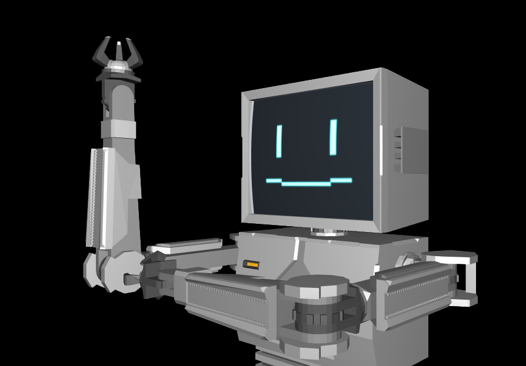

= Project-WG
Author: Chuigda<icey@icey.tech>

试图用 OpenGL 3.3（Compatibility Profile）画个可爱（？大概吧）的小机器人。

Try drawing a cute (?maybe) robot with OpenGL 3.3 (Compatibility Profile, i.e. Fixed function pipeline)

== ⚠️⚠️⚠️ 警告：包含远古技术 ⚠️⚠️⚠️
[quote]
____
项目使用了 OpenGL 的固定管线。这基本上是故意的，并且短期内不太可能会改。一般而言，固定管线早就该被丢进故纸堆了，可编程管线才是图形学的未来。
加上我自己也不怎么懂图形学的概念，只是东拼西凑一下碰巧能把东西画出来。
而且代码质量基本就是摆烂，各种命名都有很多临时起意加玩梗的要素。
所以这项目的代码你看了真的就只能图一乐，如果你抱着学习 OpenGL 或者图形学的想法走进这个仓库，那最好还是去找个别的项目学习。

当然，如果你真的喜欢这个项目，并且在“使用”过程中遇到了困难，欢迎来 issue 页面撕逼。

This project uses fixed function pipeline of OpenGL. I did this on purpose and this won't be changed within short period.
Generally speaking, fixed function pipeline should have been thrown into trashbin, since programmable pipeline is the
future of Computer Graphics. Also, I don't know much about CG so these code "just happen to work". The code quality
is also very poor, with namings of tons of jokes and memes. So you may only "Kennedy-ed" if you read these code. If you'd
like to learn OpenGL or CG, better to find some other project.

Or, maybe you really like this project and had some problem while "using" it, then come to the "issue" page
____

== ⚠️⚠️⚠️ 警告：不支持 Qt 6.4 ⚠️⚠️⚠️
项目用 Qt 6.2.4 和 Qt 6.3.2 的表现是正常的，但 Qt 6.4 上会黑屏，暂未查明原因。

This project works with Qt 6.2.4 and Qt 6.3.2, but black-screens with Qt 6.4. The reason is unknown yet.

== 许可证
* Project-WG 的代码使用 link:https://www.gnu.org/licenses/agpl-3.0.txt[AGPLv3] 授权
* 角色“WGC0310”以 link:https://creativecommons.org/licenses/by-sa/4.0/legalcode.zh-Hans[CC BY-SA 4.0] 授权

* Code of Project-WG is licensed with link:https://www.gnu.org/licenses/agpl-3.0.txt[AGPLv3]
* Character "WGC0310" is licensed with link:https://creativecommons.org/licenses/by-sa/4.0/legalcode.zh-Hans[CC BY-SA 4.0]

== 其他信息
* 机器人图标取自 link:https://www.flaticon.com/free-icons/robot[Freepik - Flaticon]
* Robot icon was taken from by link:https://www.flaticon.com/free-icons/robot[Freepik - Flaticon]
