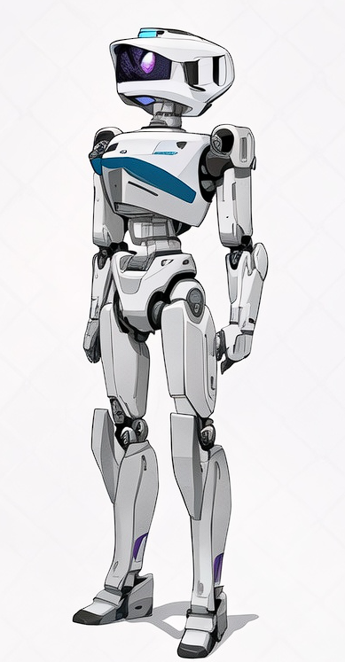
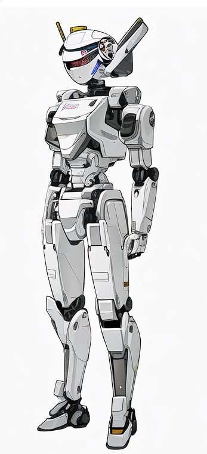

= WGC-0310 的设计案及其许可证

== B 方案

由洛阳酉告文化传播有限公司提供，经友好协商后以 link:https://creativecommons.org/licenses/by-sa/4.0/legalcode.zh-Hans[CC-BY-SA 4.0] 协议发布，**原作者保留署名权**。

原作者联系方式: 17530855327。

image::设计方案B.png[]

== C 方案

使用人工智能生成。

== 最终案 (draft, verylow)

[quote]
____
尚未确定
____
